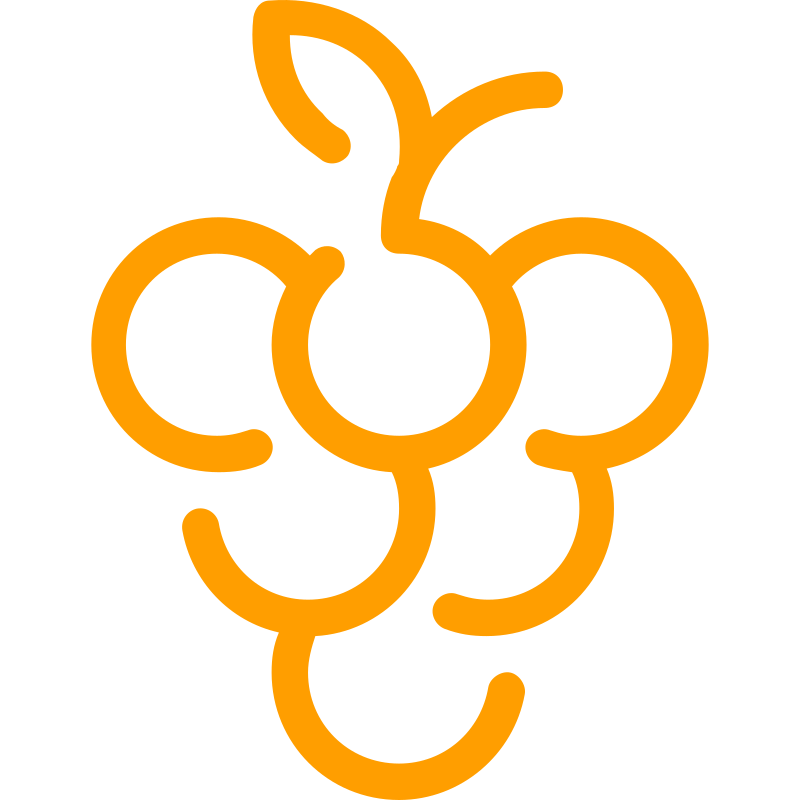

 

  

<h3>Raisin.IDE</h3>

<em>Rethinking Coding Education for the AI Era</em>

 

> **Live Demo:** https://raisin-ide.vercel.app/

### An Uphill Battle

Professional AI coding tools weren't designed for learners. They're governed by task completion as the success condition.

Any constraint that doesn't change that governance structure reverts to completion behavior over time. A post-processed, inline context injection to "teach, don't complete" is always going to be fighting against this intentional behavior. 

That's why existing tools do not feel native.

Because that's not the problem they're optimized to solve.

By and large, AI coding tools weren't (and won't be) designed with learners as the target audience. Given the revenue dynamics and macro AI game-plan, it's understandable that most startups and major AI labs are chasing professional developers. And for the enterprise team that's evaluating AI ROI, *completion* is the only metric that matters. 

### The Recalibration

But just because there's no money to be made in retail, doesn't mean that there isn't thousands, if not millions, of folks who are learning to code or trying to improve. 

In our view, the first step to serving this sizable population, is to acknowledge the need to bifurcate the treatment of coding professionals from those who are learning to code. 

It's tempting to lump these two demographics into the same group, but to quote Jeremy Keith: 

> "Java is to JavaScript as ham is to hamster." 

While the terms *professional coder* and *beginner coder* sound similar, that overlap is in name only, much like the hamster analogy. After all, knowledge acquisition (encoding) lights up a fundamentally different part of our brain than task execution (retrieval), even if those networks run parallel to each other.

### The Necessary Battle

Raisin.IDE is a bet on the fact that for this latter group of folks, a solution tailored to their needs will deliver indispensable value. 

Raisin.IDE is also a bet that learning to code will still be important despite how the role of coders will change in the age of AI.

Read our full thesis here: [blog.stackademic.com](https://blog.stackademic.com/rethinking-coding-education-for-the-ai-era-054b40a350d5).

 

  

