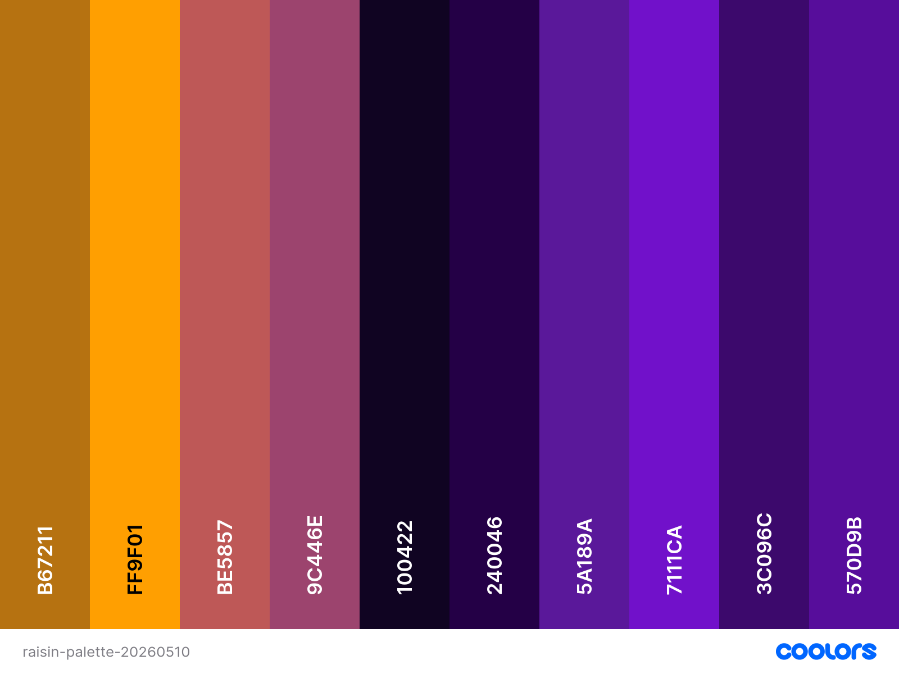
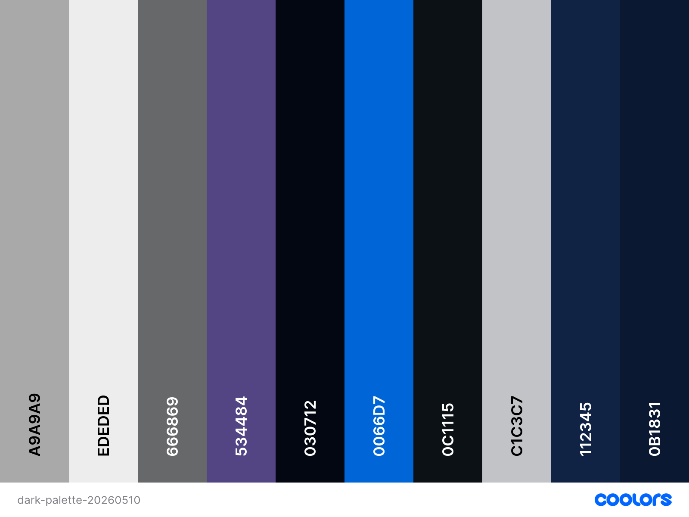
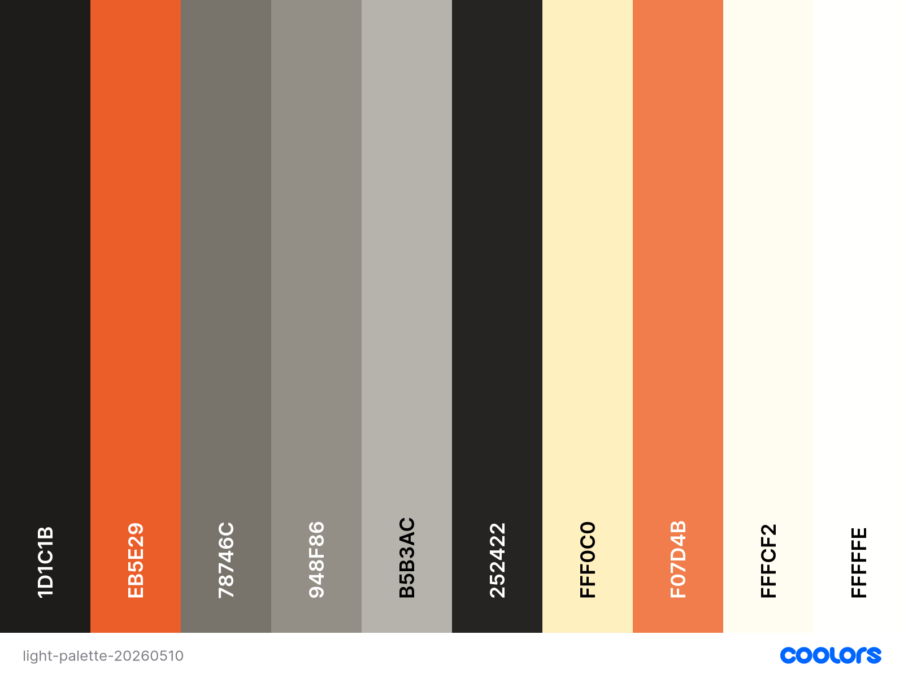

## Raisin.IDE's 3-Theme Palettes

### Design Process

Raisin's initial theme colors were inspired by the following palettes:

- "Dark": VSCode Dark :)
- "Light": [Rustic Charm](https://coolors.co/palette/fffcf2-ccc5b9-403d39-252422-eb5e28)
- "Raisin": [Vivid Nightfall](https://coolors.co/palette/10002b-240046-3c096c-5a189a-7b2cbf-9d4edd-c77dff-e0aaff)

Over the course of the first 4 sprints, I manually added and adjusted colors on an ad-hoc basis using [ColorHexa](https://www.colorhexa.com/) to find evenly spaced hues. 

At some point I lost track of the palette and turned to Figma for a more systematic approach. 

Figma's AI was able to turn the JSON of my [v0 design palette](/docs/palettes/globals-v0.json) into this beautiful dashboard editor:

- [www.figma.com/community/file/1635348616908036637](https://www.figma.com/community/file/1635348616908036637)

I then used Coolors.co's Image Picker tool to tune the final v1 palette: 

- [coolors.co/image-picker](https://coolors.co/image-picker)

*Shoutout to [Coolors.co](https://coolors.co/) for great tools that help design-challenged folks like me.*

> Check out these great designs: [coolors.co/palettes/popular](https://coolors.co/palettes/popular)

 

### Version 1 Palettes

**Brand Colors v1.0: [coolors.co/p/8KtxkuZx3Ijjep2dMlI6](https://coolors.co/p/8KtxkuZx3Ijjep2dMlI6)**

**Dark v1.0: [coolors.co/p/vXWTeoD8IHF2QYvG0PTB](https://coolors.co/p/vXWTeoD8IHF2QYvG0PTB)**

**Light v1.0: [coolors.co/p/orJzBMcQfqbo7TAYeoUe](https://coolors.co/p/orJzBMcQfqbo7TAYeoUe)**

 
